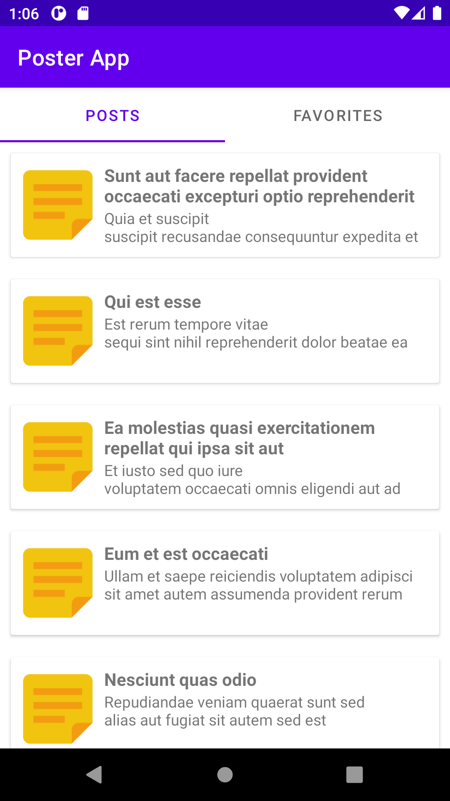
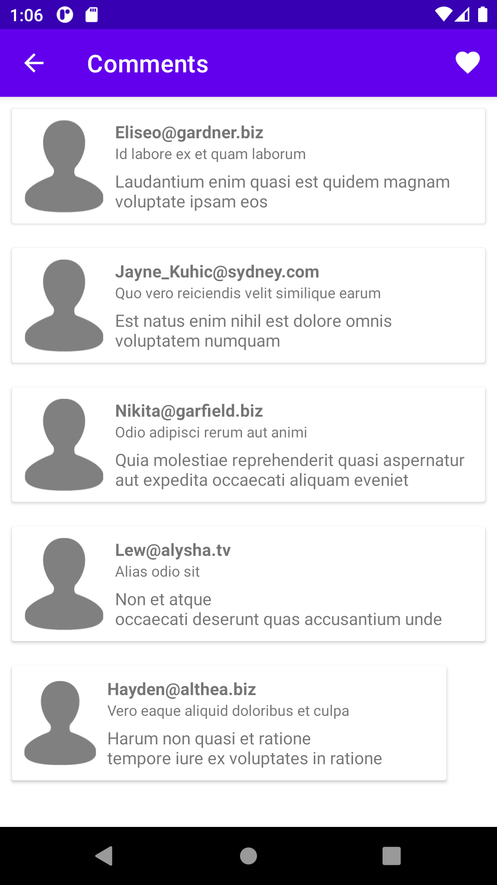
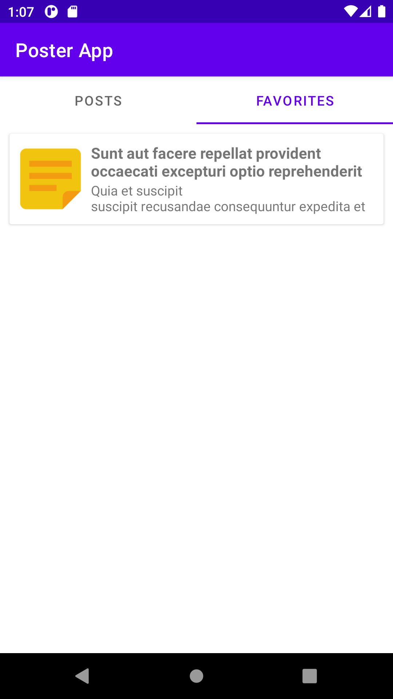

# Hilt-MVVM-Live-Data-View-Model-Kotlin-Coroutines-Room-Retrofit-Example

This is a sample project that presents a modern approach to Android app development.

The project tries to combine popular Android tools and to demonstrate best development practices by utilizing up to date tech-stack like Hilt, MVVM, Live Data, View Model etc. in Kotlin.

## Description

